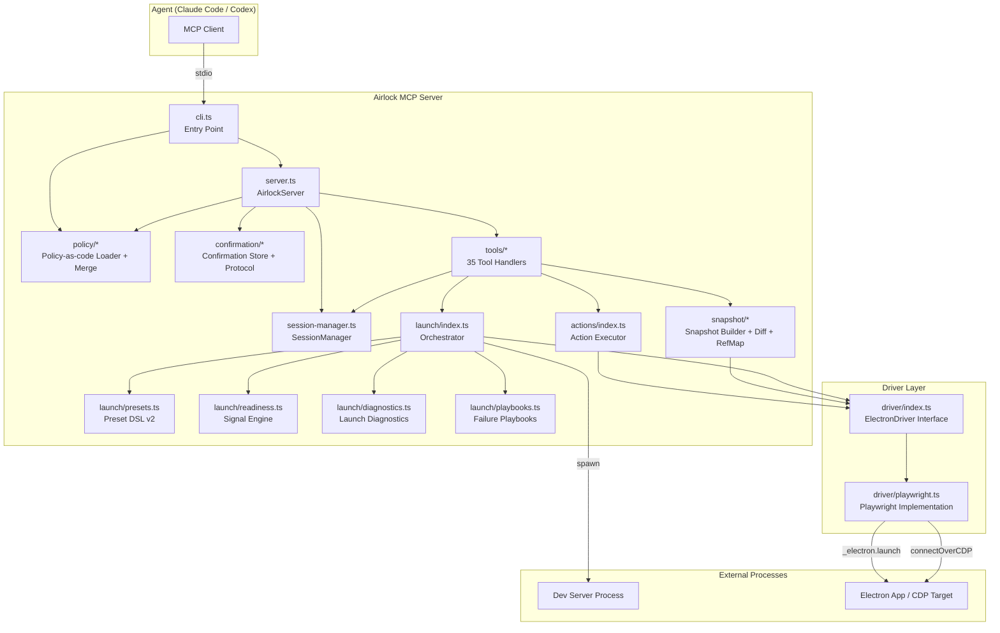
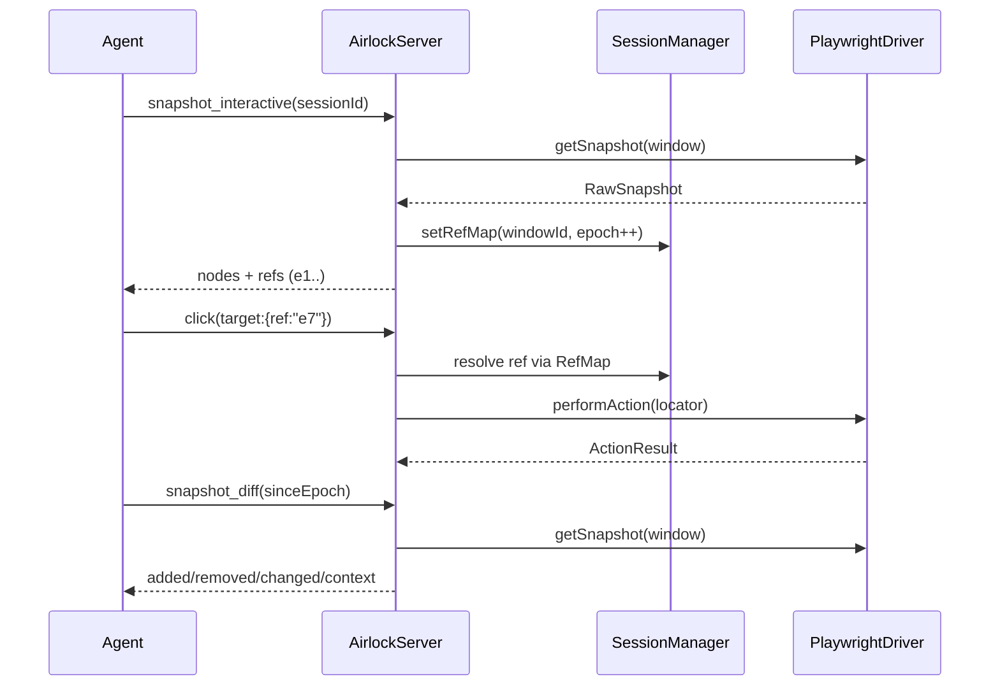
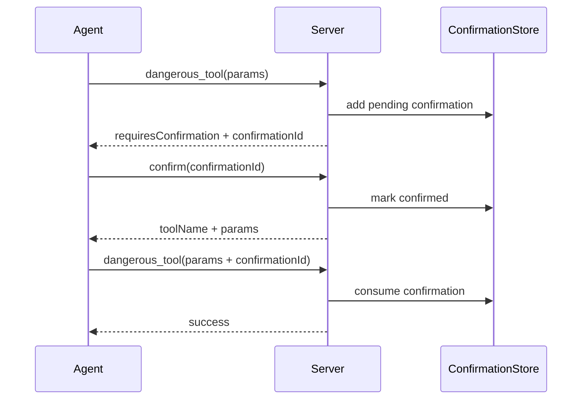

# Codebase Map

> Auto-updated for V2 implementation status.

## System Overview



## Directory Structure

```text
src/
├── cli.ts                        # CLI entry, env + policy loading, server bootstrap
├── server.ts                     # AirlockServer: tool registration, confirmation gating, envelopes
├── session-manager.ts            # Session registry, TTL cleanup, ref-map storage, window defaults
├── actions/
│   └── index.ts                  # Target resolution + action execution + failure screenshots
├── artifacts/
│   └── index.ts                  # Artifact root/session dirs + export manifest writing
├── confirmation/
│   ├── index.ts                  # Confirmation protocol helpers
│   └── store.ts                  # Pending confirmation store with TTL
├── driver/
│   ├── index.ts                  # ElectronDriver interface + shared driver types
│   └── playwright.ts             # Launch/attach, actions, snapshots, tracing, logs/network
├── launch/
│   ├── index.ts                  # Launch orchestration, attach flow, readiness orchestration
│   ├── presets.ts                # Versioned launch preset DSL (5 presets)
│   ├── readiness.ts              # Composable readiness signal engine
│   ├── diagnostics.ts            # Launch diagnostics + process output collectors
│   └── playbooks.ts              # Known failure playbook catalog + matcher
├── policy/
│   ├── index.ts                  # Policy module barrel
│   ├── schema.ts                 # Policy file schema
│   ├── loader.ts                 # JSON/YAML policy file loader
│   └── merge.ts                  # Runtime policy merge + mode ceiling enforcement
├── snapshot/
│   ├── index.ts                  # Snapshot build/query/viewport/region + diff
│   └── ref-map.ts                # RefMap with stale descriptor history + re-resolution
├── tools/
│   ├── index.ts                  # Tool registry (`coreTools`, 35 tools)
│   ├── helpers.ts                # Session/window resolution + implicit targeting heuristics
│   ├── app-launch.ts             # Launch/attach tool entry
│   ├── app-close.ts              # Session close
│   ├── app-kill.ts               # Forced process termination
│   ├── session-info.ts           # Session detail tool
│   ├── window-list.ts            # Window refresh/list
│   ├── window-focus.ts           # Focus explicit window
│   ├── window-default.ts         # Default window get/set
│   ├── wait-for-window.ts        # Wait for transient window
│   ├── click.ts                  # Click action
│   ├── type.ts                   # Type/fill action
│   ├── press-key.ts              # Keyboard action
│   ├── select.ts                 # Select action
│   ├── hover.ts                  # Hover action
│   ├── scroll-to.ts              # Best-effort scroll helper
│   ├── wait.ts                   # wait_for_idle / wait_for_visible / wait_for_text
│   ├── screenshot.ts             # Screenshot artifact capture
│   ├── snapshot.ts               # snapshot_interactive/query/viewport/diff/region
│   ├── trace.ts                  # trace_start / trace_stop
│   ├── export-artifacts.ts       # Manifest export of session diagnostics
│   ├── crash-diagnostics.ts      # diagnose_session
│   ├── console-recent.ts         # Renderer console tail
│   ├── network-recent.ts         # Renderer network tail
│   ├── capabilities.ts           # Mode + enabled tools + runtime metadata
│   ├── server-status.ts          # Uptime + active sessions
│   ├── server-reset.ts           # Reset all sessions
│   ├── doctor.ts                 # Preflight checks + playbook matching
│   └── confirm.ts                # Confirmation approval handoff
├── types/
│   ├── errors.ts                 # AirlockError definitions
│   ├── policy.ts                 # Safety policy + policy file types
│   ├── schemas.ts                # Zod I/O schemas (V1 + V2)
│   ├── session.ts                # Branded IDs + domain session/window/snapshot types
│   └── tool-result.ts            # ToolResult envelope types
└── utils/
    ├── logger.ts                 # Structured JSON logger
    ├── event-log.ts              # Event ring buffer + policy redaction patterns
    └── time.ts                   # Timestamp helper
```

## Module Guide

### CLI & Server (`src/cli.ts`, `src/server.ts`)

**Purpose**: bootstrap server with runtime mode + optional policy file, register tools, enforce mode/policy/confirmation gates.

| File            | Purpose                                                                                                                              | Est. Tokens |
| --------------- | ------------------------------------------------------------------------------------------------------------------------------------ | ----------: |
| `src/cli.ts`    | Parse CLI args/env (`AIRLOCK_MODE`, `AIRLOCK_PRESET`, `AIRLOCK_POLICY`, `AIRLOCK_ARTIFACT_ROOT`), resolve policy, start stdio server |       ~1.9k |
| `src/server.ts` | MCP tool registration, input/output validation, mode/policy gating, confirmation protocol, event logging                             |       ~5.4k |

### Session Manager (`src/session-manager.ts`)

**Purpose**: in-memory session registry + TTL cleanup + ref maps + window-default tracking.

| File                     | Purpose                                                                | Est. Tokens |
| ------------------------ | ---------------------------------------------------------------------- | ----------: |
| `src/session-manager.ts` | Session add/get/list/touch/reset, trace state, ref maps, stale cleanup |       ~1.5k |

### Driver Layer (`src/driver/`)

**Purpose**: abstraction and Playwright-based implementation for launch/attach/actions/snapshots/tracing/logs.

| File                       | Purpose                                                                                                          | Est. Tokens |
| -------------------------- | ---------------------------------------------------------------------------------------------------------------- | ----------: |
| `src/driver/index.ts`      | Driver interface + launch/attach/action/snapshot/log/trace contracts                                             |       ~1.1k |
| `src/driver/playwright.ts` | Playwright Electron + CDP attach runtime, tracing, console/network buffers, snapshot extraction, action dispatch |      ~12.5k |

### Launch Subsystem (`src/launch/`)

**Purpose**: preset-based orchestration with composable readiness and actionable diagnostics.

| File                        | Purpose                                                              | Est. Tokens |
| --------------------------- | -------------------------------------------------------------------- | ----------: |
| `src/launch/index.ts`       | Main launch/attach orchestrator, fallback attach, diagnostics wiring |       ~7.8k |
| `src/launch/presets.ts`     | Preset DSL v2 + shipped preset catalog                               |       ~1.7k |
| `src/launch/readiness.ts`   | Reusable readiness signals + timeline diagnostics                    |       ~3.8k |
| `src/launch/diagnostics.ts` | Process output/event collectors + sanitized diagnostics builder      |       ~2.3k |
| `src/launch/playbooks.ts`   | Failure playbook definitions + matcher by preset/platform/error text |       ~1.8k |

### Policy Subsystem (`src/policy/`)

**Purpose**: policy-as-code loading, validation, and merge with runtime mode defaults.

| File                   | Purpose                                                       | Est. Tokens |
| ---------------------- | ------------------------------------------------------------- | ----------: |
| `src/policy/schema.ts` | Zod schema for policy file format                             |        ~280 |
| `src/policy/loader.ts` | JSON/YAML loader with validation + structured errors          |        ~950 |
| `src/policy/merge.ts`  | Merge policy file with mode defaults + origin/mode/TTL guards |        ~950 |

### Confirmation Subsystem (`src/confirmation/`)

**Purpose**: confirmation gate storage and helper primitives for policy-gated tools.

| File                        | Purpose                                               | Est. Tokens |
| --------------------------- | ----------------------------------------------------- | ----------: |
| `src/confirmation/index.ts` | Confirmation helpers + protocol utilities             |        ~320 |
| `src/confirmation/store.ts` | Confirmation TTL store with consume/cleanup semantics |        ~450 |

### Snapshot Processing (`src/snapshot/`)

**Purpose**: transform raw snapshots into token-capped, ref-addressable snapshots with diff/region support.

| File                      | Purpose                                                                | Est. Tokens |
| ------------------------- | ---------------------------------------------------------------------- | ----------: |
| `src/snapshot/index.ts`   | interactive/viewport/query/region snapshot builders + diff computation |       ~6.9k |
| `src/snapshot/ref-map.ts` | Ref descriptor cache, stale history, cross-epoch re-resolution         |       ~2.0k |

### Actions (`src/actions/`)

**Purpose**: resolve targets (ref/testId/role/css), execute driver action, capture diagnostics/screenshots.

| File                   | Purpose                                           | Est. Tokens |
| ---------------------- | ------------------------------------------------- | ----------: |
| `src/actions/index.ts` | Action target resolution + executeAction pipeline |       ~3.1k |

### Tools (`src/tools/`)

**Purpose**: MCP tool surface (35 tools total).

- Session/Lifecycle: `app_launch`, `app_close`, `app_kill`, `session_info`
- Windowing: `window_list`, `window_focus`, `window_default_get`, `window_default_set`, `wait_for_window`
- Snapshot/Context: `snapshot_interactive`, `snapshot_viewport`, `snapshot_query`, `snapshot_diff`, `snapshot_region`, `scroll_to`
- Actions: `click`, `type`, `press_key`, `select`, `hover`, `screenshot`
- Waits: `wait_for_idle`, `wait_for_visible`, `wait_for_text`
- Observability/Diagnostics: `console_recent`, `network_recent`, `trace_start`, `trace_stop`, `export_artifacts`, `diagnose_session`, `doctor`, `server_status`, `capabilities`
- Safety/Control: `confirm`, `server_reset`

### Types (`src/types/`)

**Purpose**: domain models, errors, policy types, and I/O schemas.

- `src/types/schemas.ts` now includes V2 schemas for launch diagnostics, snapshot diff/region, trace/export/diagnostics, policy confirmation, and window defaults.

### Utilities (`src/utils/`)

**Purpose**: structured logging, redacted event audit log, timestamp helpers.

- `src/utils/event-log.ts` supports policy-provided regex redaction patterns in addition to key-based redaction.

### Artifacts (`src/artifacts/`)

**Purpose**: artifact directory creation and V2 export manifest generation.

- Session exports are written under `artifacts/<sessionId>/exports/<timestamp>/` with manifest + collected paths.

## Data Flow

### Snapshot-Act-Diff Loop (V2)



### Confirmation Gate Protocol



## Conventions

- TypeScript ESM + strict mode (`exactOptionalPropertyTypes`, `noUncheckedIndexedAccess`).
- Named exports and kebab-case module naming.
- Tool definitions via `defineAirlockTool(...)` + zod schema boundaries.
- Tool outputs use `ToolResult<T>` with optional `meta` diagnostics/suggestions/warnings.
- Safety posture enforced by mode + policy + optional confirmation gate.

## Gotchas

1. `capabilities` preset list reflects CLI-configured `supportedPresets`, while launch registry contains additional presets.
2. Attach-first automation is implemented via preset/orchestration flow, not a dedicated `app_attach` MCP tool.
3. `export_artifacts` produces a manifest export directory, not a zip archive.
4. `roots`/`allowedEnvVars` policy fields are parsed and merged but not universally enforced across all tool execution paths.
5. Refs remain ephemeral; cross-epoch re-resolution works when locator identity hints remain unique.

## Navigation Guide

- Add a new launch preset: edit `src/launch/presets.ts`, then update tests in `src/launch/presets.test.ts`.
- Add a readiness signal: implement/check in `src/launch/readiness.ts`, compose in `src/launch/index.ts`.
- Add policy behavior: extend `src/policy/schema.ts`, load in `src/policy/loader.ts`, merge/enforce in `src/policy/merge.ts` and/or `src/server.ts`.
- Add confirmation-gated behavior: configure `policy.tools.requireConfirmation`, then rely on server confirmation flow and `confirm` tool.
- Add a new MCP tool: implement in `src/tools/`, add schemas in `src/types/schemas.ts`, register in `src/tools/index.ts`.
- Modify snapshot diff/region behavior: edit `src/snapshot/index.ts` and `src/tools/snapshot.ts`.
- Update implicit window targeting logic: edit `src/tools/helpers.ts`.
