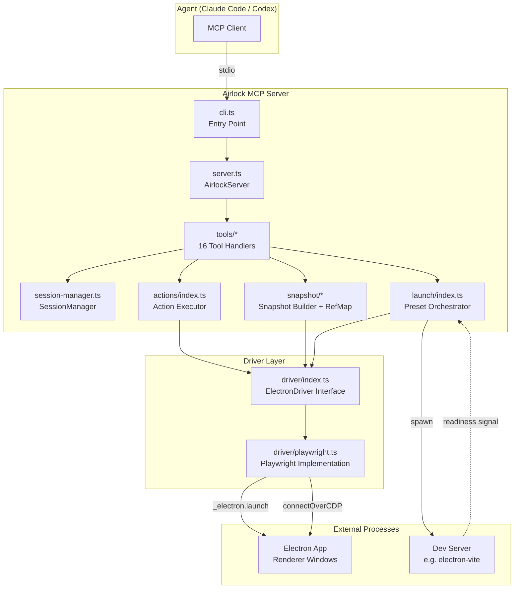
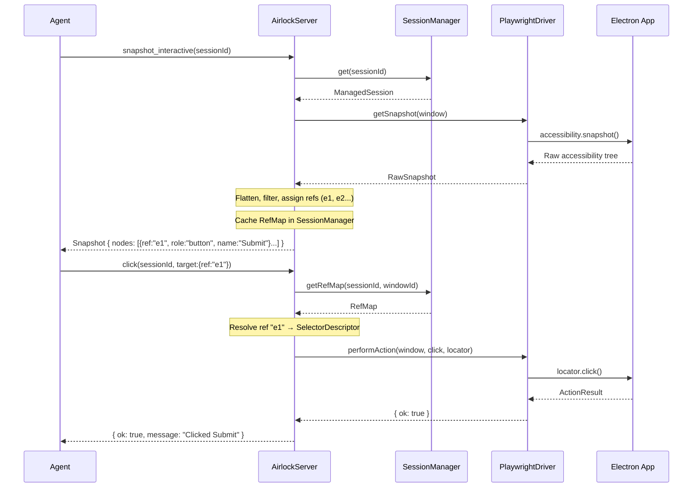
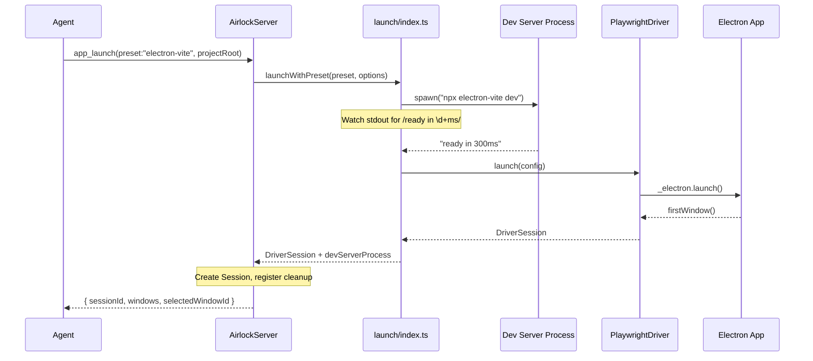
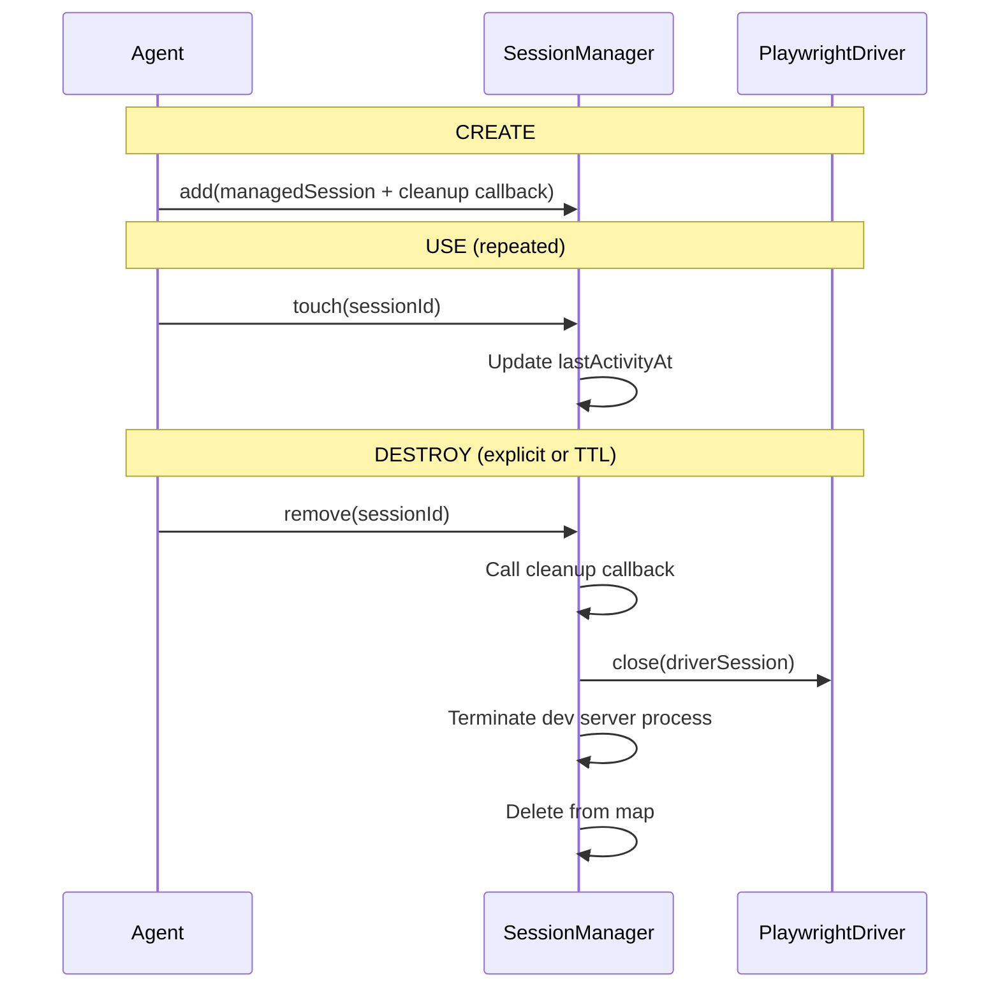

# Codebase Map

> Auto-generated by Cartographer. Last mapped: 2026-02-07T23:01:37Z

## System Overview



## Directory Structure

```
src/
├── cli.ts                  # CLI entry, env parsing, server bootstrap
├── server.ts               # AirlockServer: MCP tool registration, I/O validation, envelopes
├── session-manager.ts      # In-memory session registry, TTL cleanup, RefMap storage
├── actions/
│   └── index.ts            # Target resolution (ref→locator) and action execution
├── artifacts/
│   └── index.ts            # Session artifact directory creation/cleanup
├── driver/
│   ├── index.ts            # ElectronDriver interface and all driver types
│   └── playwright.ts       # Playwright implementation: launch, attach, actions, snapshots
├── launch/
│   └── index.ts            # Launch presets (electron-vite), dev server orchestration
├── snapshot/
│   ├── index.ts            # Accessibility tree → filtered snapshot with ref assignment
│   └── ref-map.ts          # RefMap: ref→SelectorDescriptor mapping with epoch tracking
├── tools/
│   ├── index.ts            # Tool registry, coreTools array (17 tools)
│   ├── helpers.ts          # Shared: session/window resolution, result wrapping
│   ├── app-launch.ts       # Launch/attach Electron app
│   ├── app-close.ts        # Close session, trigger cleanup
│   ├── click.ts            # Click element by target
│   ├── type.ts             # Type text (append or fill/replace)
│   ├── press-key.ts        # Press keyboard key with modifiers
│   ├── screenshot.ts       # Capture window PNG to artifacts
│   ├── snapshot.ts         # 3 variants: interactive, viewport, query
│   ├── wait.ts             # 3 variants: idle, visible, text
│   ├── window-list.ts      # Refresh and list session windows
│   ├── capabilities.ts     # Report mode capabilities and enabled tools
│   ├── server-status.ts    # Session summary and uptime
│   ├── console-recent.ts   # Recent console log entries
│   └── doctor.ts           # Environment diagnostics (Playwright, Node, Electron)
├── types/
│   ├── index.ts            # Re-export all types
│   ├── errors.ts           # AirlockError, error codes, factory
│   ├── policy.ts           # SafetyMode, capabilities matrix, policy factory
│   ├── schemas.ts          # Zod schemas for all tool inputs/outputs
│   ├── session.ts          # Branded IDs, Session, Window, Snapshot types
│   └── tool-result.ts      # ToolResult<T> envelope with meta (suggestions/warnings)
└── utils/
    ├── index.ts            # Re-export utilities
    ├── logger.ts           # Structured JSON logging to stderr
    ├── event-log.ts        # Tool invocation audit log with redaction (ring buffer)
    └── time.ts             # Timestamp conversion utility
```

## Module Guide

### CLI & Server (`src/cli.ts`, `src/server.ts`)

**Purpose**: Bootstrap and orchestrate the MCP server.

| File        | Purpose                                                                                                                                        | Tokens |
| ----------- | ---------------------------------------------------------------------------------------------------------------------------------------------- | ------ |
| `cli.ts`    | Parse env vars (`AIRLOCK_MODE`, `AIRLOCK_PRESET`, `AIRLOCK_ARTIFACT_ROOT`), create driver/server, start stdio transport, handle SIGINT/SIGTERM | 907    |
| `server.ts` | `AirlockServer` class: tool registration, Zod input/output validation, error normalization, envelope wrapping, event logging                   | 3,656  |

**Key Exports**: `AirlockServer`, `defineAirlockTool`, `AirlockToolContext`, `AirlockToolDefinition`
**Dependencies**: `@modelcontextprotocol/sdk` (McpServer, StdioServerTransport), `zod`, session-manager, driver interface, tools

### Session Manager (`src/session-manager.ts`)

**Purpose**: In-memory session registry with TTL-based cleanup.

| File                 | Purpose                                                                                        | Tokens |
| -------------------- | ---------------------------------------------------------------------------------------------- | ------ |
| `session-manager.ts` | Map of `sessionId → ManagedSession`. TTL cleanup, per-window RefMap storage, cleanup callbacks | 1,202  |

**Key Exports**: `SessionManager`, `ManagedSession`
**Key Type**: `ManagedSession = { session, driverSession?, refMaps?, cleanup? }`
**TTLs**: safe=30min, standard=2hr, trusted=8hr

### Driver Layer (`src/driver/`)

**Purpose**: Abstraction for Electron automation backends.

| File            | Purpose                                                                                                                                                           | Tokens |
| --------------- | ----------------------------------------------------------------------------------------------------------------------------------------------------------------- | ------ |
| `index.ts`      | `ElectronDriver` interface, all driver types (DriverSession, DriverWindow, RawSnapshot, ActionTarget, ActionResult)                                               | 764    |
| `playwright.ts` | Playwright implementation: `_electron.launch()`, `chromium.connectOverCDP()`, accessibility tree extraction, action execution, console capture, window management | 8,275  |

**Key Exports**: `ElectronDriver` (interface), `PlaywrightElectronDriver`, `createPlaywrightElectronDriver`
**Key Constants**: `DEFAULT_LAUNCH_TIMEOUT_MS=30_000`, `DEFAULT_FIRST_WINDOW_TIMEOUT_MS=20_000`, `DEFAULT_ACTION_TIMEOUT_MS=5_000`, `CONSOLE_BUFFER_LIMIT=500`

### Launch Orchestration (`src/launch/`)

**Purpose**: Dev server startup and Electron launch with presets.

| File       | Purpose                                                                                                              | Tokens |
| ---------- | -------------------------------------------------------------------------------------------------------------------- | ------ |
| `index.ts` | Preset definitions, dev server spawning, readiness detection (regex on stdout), Electron launch, CDP attach fallback | 3,238  |

**Key Exports**: `ELECTRON_VITE_PRESET`, `resolvePreset()`, `launchWithPreset()`, `launchCustom()`
**Preset**: electron-vite runs `npx electron-vite dev`, waits for `/ready in \d+ms/i`

### Snapshot Processing (`src/snapshot/`)

**Purpose**: Convert raw accessibility trees to ref-annotated, filtered snapshots.

| File         | Purpose                                                                                                        | Tokens |
| ------------ | -------------------------------------------------------------------------------------------------------------- | ------ |
| `index.ts`   | Flatten tree, filter (interactive/viewport/query), assign refs ("e1", "e2"), build locator hints, truncate     | 3,497  |
| `ref-map.ts` | `RefMap` class: ref→SelectorDescriptor mapping, epoch tracking, stale detection, Playwright locator conversion | 874    |

**Key Exports**: `buildSnapshot()`, `buildViewportSnapshot()`, `buildQuerySnapshot()`, `RefMap`, `SelectorDescriptor`
**Descriptor Priority**: testId(100) > role+name(90) > label(80) > text(70) > css(10)

### Actions (`src/actions/`)

**Purpose**: Resolve targets and execute actions with diagnostic capture on failure.

| File       | Purpose                                                                                                | Tokens |
| ---------- | ------------------------------------------------------------------------------------------------------ | ------ |
| `index.ts` | `executeAction()`: resolve ref/selector → Playwright locator, call driver, capture failure screenshots | 2,473  |

**Key Exports**: `executeAction()`, `resolveTarget()`, `ResolvedTarget`

### Tools (`src/tools/`)

**Purpose**: 17 MCP tool implementations following `defineAirlockTool()` pattern.

| File                | Purpose                                                                      | Tokens |
| ------------------- | ---------------------------------------------------------------------------- | ------ |
| `index.ts`          | Tool registry, `coreTools` array                                             | 414    |
| `helpers.ts`        | Shared: `resolveManagedSession()`, `resolveWindow()`, `toActionToolResult()` | 817    |
| `app-launch.ts`     | Launch/attach Electron app, create session, register cleanup                 | 2,322  |
| `app-close.ts`      | Close session, trigger cleanup callback                                      | 537    |
| `snapshot.ts`       | 3 tools: interactive, viewport, query — all cache RefMap                     | 1,720  |
| `click.ts`          | Click element by target                                                      | 478    |
| `type.ts`           | Type text (fill vs type based on `replace` flag)                             | 454    |
| `press-key.ts`      | Press keyboard key with modifiers                                            | 488    |
| `wait.ts`           | 3 tools: wait_for_idle, wait_for_visible, wait_for_text                      | 1,062  |
| `screenshot.ts`     | Capture PNG to artifacts directory                                           | 525    |
| `window-list.ts`    | Refresh and list windows (only way to detect new windows)                    | 912    |
| `console-recent.ts` | Recent console logs with level filtering                                     | 816    |
| `capabilities.ts`   | Report mode capabilities and enabled tools                                   | 644    |
| `server-status.ts`  | Active sessions and uptime                                                   | 699    |
| `doctor.ts`         | Environment diagnostics                                                      | 1,364  |

### Types (`src/types/`)

**Purpose**: Type definitions, Zod schemas, and safety policy.

| File             | Purpose                                                                                        | Tokens |
| ---------------- | ---------------------------------------------------------------------------------------------- | ------ |
| `errors.ts`      | `AirlockError` interface, 12 error codes, `createAirlockError()` factory                       | 227    |
| `policy.ts`      | `SafetyMode`, `SAFETY_CAPABILITIES` matrix, `defaultPolicyForMode()`                           | 445    |
| `session.ts`     | Branded IDs (`SessionId`, `WindowId`, `RefId`), `Session`, `Window`, `SnapshotNode`            | 589    |
| `schemas.ts`     | Zod schemas for all tool I/O, `ActionTargetSchema` (mutual exclusivity), `SnapshotQuerySchema` | 2,259  |
| `tool-result.ts` | `ToolResult<T>` with optional `meta: { suggestions, warnings, diagnostics }`                   | 48     |

### Utilities (`src/utils/`)

**Purpose**: Logging, event tracking, time conversion.

| File           | Purpose                                                                               | Tokens |
| -------------- | ------------------------------------------------------------------------------------- | ------ |
| `logger.ts`    | Structured JSON logging to stderr, child loggers with scoped context                  | 615    |
| `event-log.ts` | `EventLog`: tool invocation audit ring buffer (max 2000), redaction of sensitive keys | 734    |
| `time.ts`      | `toTimestampMs()`: ISO string → milliseconds                                          | 20     |

### Artifacts (`src/artifacts/`)

**Purpose**: Manage `.airlock/electron/` directory structure.

| File       | Purpose                                                                              | Tokens |
| ---------- | ------------------------------------------------------------------------------------ | ------ |
| `index.ts` | `resolveArtifactRoot()`, `ensureArtifactDirectories()`, `createSessionArtifactDir()` | 359    |

**Structure**: `.airlock/electron/{artifacts/<sessionId>/screenshots/, logs/, traces/}`

## Data Flow

### Snapshot-Act-Snapshot Loop



### Launch Orchestration



### Session Lifecycle



## Conventions

- **File naming**: kebab-case (`session-manager.ts`, `app-launch.ts`)
- **Exports**: Named exports only, re-exported from `index.ts` barrel files
- **Imports**: ESM with `.js` extensions, `import type` for type-only imports
- **Immutability**: `const` preferred over `let` everywhere
- **IDs**: Branded string types (`SessionId`, `WindowId`, `RefId`) prevent mixing at compile time
- **Validation**: Zod schemas at all tool boundaries with `superRefine` for cross-field checks
- **Errors**: Normalized to `AirlockError` with code, message, retriable flag, and details
- **Tool pattern**: `defineAirlockTool({ name, title, description, inputSchema, outputSchema, allowedModes?, handler })`
- **Logging**: Structured JSON to stderr via `createLogger()` with child scoping
- **TypeScript config**: Very strict — `noUncheckedIndexedAccess`, `exactOptionalPropertyTypes`, `strict: true`

## Gotchas

1. **Playwright Electron support is experimental** — Launch can fail if Electron has `nodeCliInspect` fuse disabled. `firstWindow()` timeout is a common failure point.
2. **Refs are ephemeral** — Tied to a specific snapshot version/epoch. Any UI mutation can make refs stale. Agent must take a new snapshot after actions that change the DOM.
3. **`window_list` is the only way to discover new windows** — Windows opened after launch are not automatically tracked.
4. **Dev server process needs manual termination** — The cleanup callback handles this, but if the process crashes or cleanup is skipped, orphan processes remain.
5. **Console logs before session attach are lost** — The ring buffer only captures messages after the console listener is bound.
6. **Mode is immutable at runtime** — Set via `AIRLOCK_MODE` env var at server startup. Cannot be changed without restart.
7. **Snapshot truncation is aggressive** — Default `maxNodes=250`, `maxTextCharsPerNode=80`. Large apps will be heavily pruned.
8. **CDP attach fallback** requires `--remote-debugging-port` in Electron args.
9. **Cleanup errors are collected, not thrown** — `SessionManager.cleanupStale()` returns failure array rather than throwing.

## Navigation Guide

**To add a new tool**: Create `src/tools/<name>.ts` using `defineAirlockTool()`, add Zod schemas in `src/types/schemas.ts`, export from `src/tools/index.ts` and add to `coreTools` array.

**To add a new launch preset**: Add preset definition in `src/launch/index.ts` alongside `ELECTRON_VITE_PRESET`, update `resolvePreset()`.

**To add a new driver backend**: Implement `ElectronDriver` interface from `src/driver/index.ts`, wire it up in `src/cli.ts`.

**To modify snapshot filtering**: Edit `src/snapshot/index.ts` — `buildSnapshot()` for interactive filter, `buildViewportSnapshot()` for viewport, `buildQuerySnapshot()` for query.

**To add a new error code**: Add to `AIRLOCK_ERROR_CODES` in `src/types/errors.ts`.

**To change safety capabilities**: Edit `SAFETY_CAPABILITIES` in `src/types/policy.ts`.
